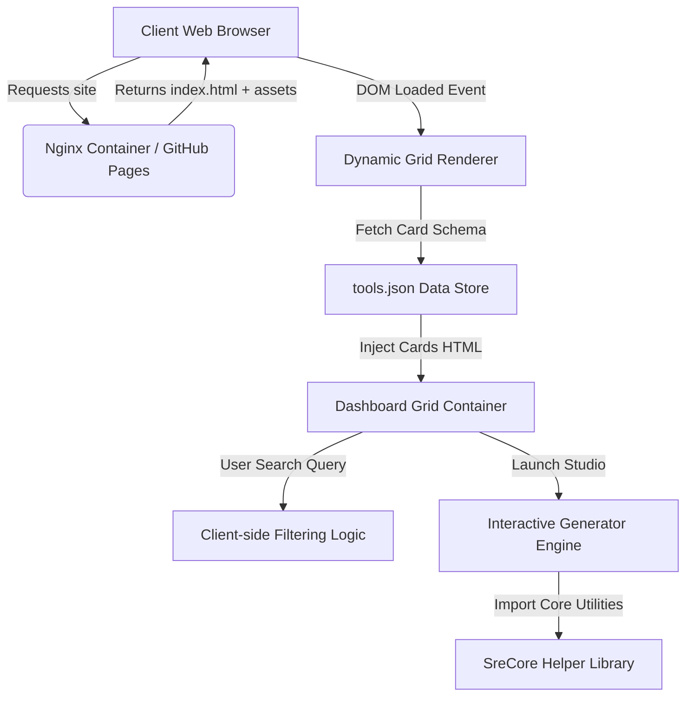

# Platform Architecture Design

This document details the architectural layout, modules separation, and data flows within the portfolio dashboard and SRE interactive studios.

---

## 🏗️ System Overview

The platform is designed as an ultra-lightweight, high-performance Static Single-Page App (SPA) dashboard served via static hosting or containerized proxies. To minimize page load times and runtime execution overhead, it relies on modern native ES Modules, vanilla CSS design systems, and client-side dynamic DOM rendering.

---

## 🧩 Architectural Components

### 1. Data Store Registry (`tools.json`)
The central registry database [tools.json](file:///d:/Domain/tools/tools.json) holds configuration maps for all 77 DevOps and SRE interactive studios. It acts as the single source-of-truth, containing:
* Title & Description strings.
* Visual properties (colors, SVG tags, borders).
* Navigation paths and classification markers (AI/MLOps, Cloud, Observability, CI/CD, Automation).

### 2. Launchpad Dynamic Compiler
Upon the `DOMContentLoaded` event, [tools/index.html](file:///d:/Domain/tools/index.html) parses `tools.json`. This script maps JSON records into lightweight `.tool-card` HTML templates and appends them to the DOM.
* **Benefits:** Prevents DOM duplication, keeps index bundle under 100 KB, and guarantees 100% parity with layout filter controls, SEO search, and PWA installation scripts.

### 3. SRE Core Framework (`SreCore`)
Residing at [src/js/core-tool.js](file:///d:/Domain/src/js/core-tool.js), this global namespace utility isolates common UI requirements from individual generator script pages:
* **Log Console Formatting:** Sanitizes error/info logging streams via DOM `textContent` interfaces to eliminate Cross-Site Scripting (XSS) injection routes.
* **Tab Routing Controller:** Handles active tab status class toggle rules and displays simulator viewports dynamically.
* **Feedback Clipboard Copier:** Standardized clipboard write handlers with button feedback animations.

### 4. Build Bundler Pipeline (Vite + Rollup)
* The Vite bundler takes individual studio layouts and generator scripts, packages them into static assets, compresses SVGs, bundles scripts using tree-shaking compile optimizations, and places production outputs inside `dist/`.
