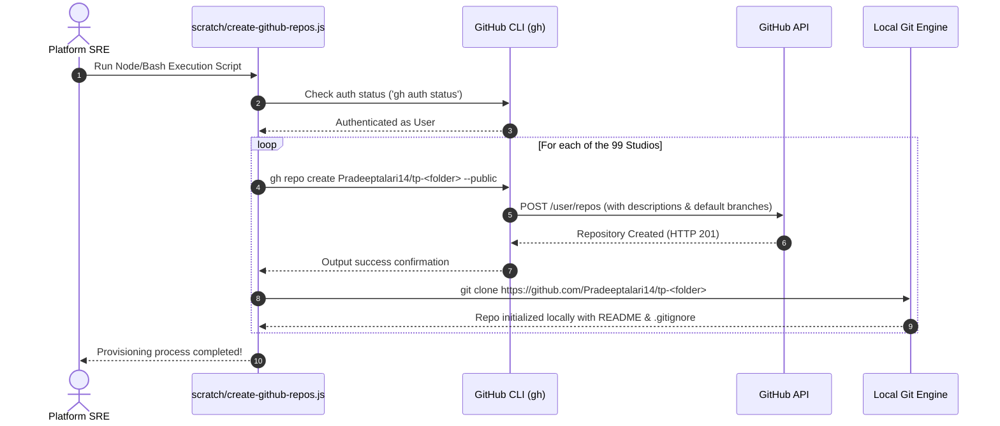
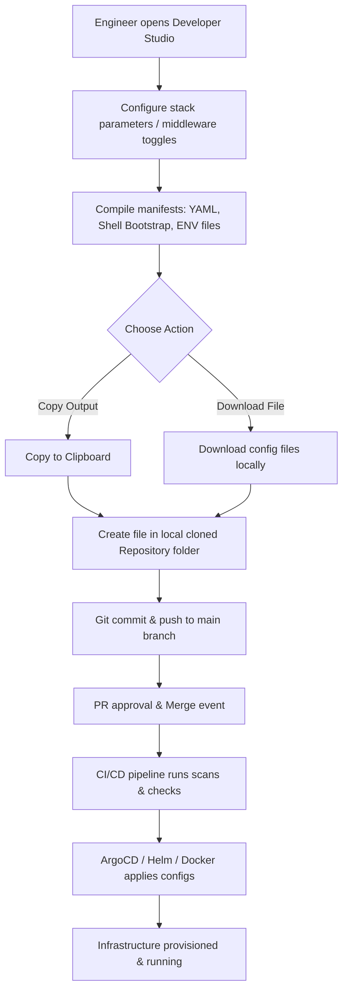

# Developer Studios: GitHub Provisioning & Execution Guide

This handbook provides SREs and Platform Engineers with the exact commands and pipeline flow to bootstrap GitHub repositories and execute compiled configurations for all **99 Developer Studios** in the portfolio.

---

## 1. System Architecture Flows

### SRE Architecture Diagrams by Domain
Each developer studio repository category contains its own tailored SRE architecture diagram in its `docs/` folder:

*   **AI & MLOps (`ai`):** [`sre_architecture_flow_ai.png`](sre_architecture_flow_ai.png)
*   **Cloud & Infrastructure (`cloud`):** [`sre_architecture_flow_cloud.png`](sre_architecture_flow_cloud.png)
*   **CI/CD Pipelines (`cicd`):** [`sre_architecture_flow_cicd.png`](sre_architecture_flow_cicd.png)
*   **Config & Automation (`automation`):** [`sre_architecture_flow_automation.png`](sre_architecture_flow_automation.png)
*   **Telemetry & Observability (`observability`):** [`sre_architecture_flow_observability.png`](sre_architecture_flow_observability.png)

Below is a visual diagram showing the **Cloud & Infrastructure Architecture**:


### A. Repository Provisioning Lifecycle
This sequence illustrates how target repositories are programmatically created using the GitHub CLI:



### B. Configuration Compiler & Run Pipeline
This flowchart shows the development loop: from interactive parameters config in a studio down to Kubernetes/Docker/Cloud execution:



---

## 2. Batch Repository Creation Automation Script

You can copy and save the script below as `scratch/create-github-repos.js` on your machine, then execute it to automatically create all 91 public repositories under your profile:

```javascript
// File: scratch/create-github-repos.js
const { execSync } = require('child_process');
const fs = require('fs');
const path = require('path');

// Verify GitHub CLI is installed
try {
  execSync('gh --version', { stdio: 'ignore' });
} catch (e) {
  console.error("❌ Error: GitHub CLI ('gh') is not installed. Please download from https://cli.github.com/");
  process.exit(1);
}

// Verify CLI auth status
try {
  execSync('gh auth status', { stdio: 'inherit' });
} catch (e) {
  console.error("❌ Error: Not authenticated with GitHub. Run 'gh auth login' first.");
  process.exit(1);
}

const toolsPath = path.resolve(__dirname, '../tools/tools.json');
const tools = JSON.parse(fs.readFileSync(toolsPath, 'utf8'));

console.log(`🚀 Found ${tools.length} studios. Starting batch creation on GitHub...`);

tools.forEach((tool, index) => {
  const repoName = tool.repository; // Format: Pradeeptalari14/tp-<folder>
  const description = `Developer Studio repository for ${tool.title}. Category: ${tool.category}.`;
  
  console.log(`[${index + 1}/${tools.length}] Creating repository: ${repoName}...`);
  try {
    // Run gh command to create repository
    execSync(`gh repo create "${repoName}" --public --description "${description}"`, { stdio: 'inherit' });
    console.log(`✅ Created ${repoName}`);
  } catch (err) {
    console.warn(`⚠️ Warning: Repository ${repoName} might already exist. Skipping...`);
  }
});

console.log("🎉 All 99 target repositories have been processed!");
```

---

## 3. Exhaustive 99-Repository Execution Matrix

This table lists every studio, its Git repository name, the primary configuration file it compiles, where that file should be committed, and the exact command line strings to apply and verify the setup:

| # | Studio Name | Target GitHub Repository | Primary Config | Commit Destination | Execution Command | Validation Command |
|---|---|---|---|---|---|---|
| 1 | DevOps AI RAG Studio | `Pradeeptalari14/tp-ai` | `rag_engine.py` | `/app/rag` | `python rag_engine.py` | `curl localhost:8501` |
| 2 | Enterprise LLM Studio | `Pradeeptalari14/tp-llm` | `deployment.yaml` | `/deploy/k8s` | `kubectl apply -f deployment.yaml` | `kubectl get pods -l app=llm` |
| 3 | Local SLM Studio | `Pradeeptalari14/tp-slm` | `Modelfile` | `/models/ollama` | `ollama create mymodel -f Modelfile` | `ollama list` |
| 4 | MLflow Tracking Studio | `Pradeeptalari14/tp-mlflow` | `docker-compose.yml` | `/deploy/compose` | `docker compose up -d` | `docker ps -f name=mlflow` |
| 5 | Strands SRE Agent Studio | `Pradeeptalari14/tp-strands` | `agent.py` | `/src/agents` | `python agent.py` | `python -m pytest tests/` |
| 6 | LLM Guardrails Studio | `Pradeeptalari14/tp-llm-guardrails` | `config.yaml` | `/config/guardrails` | `nemoguardrails start` | `nemoguardrails status` |
| 7 | Ray Cluster Studio | `Pradeeptalari14/tp-ray-cluster` | `ray_cluster.yaml` | `/deploy/ray` | `kubectl apply -f ray_cluster.yaml` | `kubectl get pods -n ray` |
| 8 | AI Evaluation Studio | `Pradeeptalari14/tp-ai-eval` | `eval_pipeline.py` | `/src/eval` | `python eval_pipeline.py` | `python -m unittest eval_pipeline.py` |
| 9 | Feature Store Studio | `Pradeeptalari14/tp-feature-store` | `feature_store.yaml` | `/src/features` | `feast apply` | `feast status` |
| 10 | LLM Gateway & API Router Studio | `Pradeeptalari14/tp-llm-gateway` | `litellm-config.yaml` | `/config/litellm` | `litellm --config litellm-config.yaml` | `curl localhost:4000/health` |
| 11 | LLM Observability & Tracing Studio | `Pradeeptalari14/tp-llm-tracing` | `langfuse-compose.yml` | `/deploy/langfuse` | `docker compose -f langfuse-compose.yml up -d` | `docker ps` |
| 12 | Vector Database Optimizer Studio | `Pradeeptalari14/tp-vector-db` | `qdrant-config.yaml` | `/config/qdrant` | `qdrant --config-path qdrant-config.yaml` | `curl localhost:6333/dashboard` |
| 13 | SRE AI Agent Simulator | `Pradeeptalari14/tp-sre-simulator` | `triage_agent.py` | `/src/simulator` | `python triage_agent.py` | `python -m pytest triage_agent.py` |
| 14 | MCP Studio | `Pradeeptalari14/tp-mcp-studio` | `mcp_config.json` | `~/.config/Claude` | `mcp run mcp_config.json` | `mcp status` |
| 15 | Ansible Playbook Builder | `Pradeeptalari14/tp-ansible` | `playbook.yml` | `/playbooks` | `ansible-playbook -i hosts playbook.yml` | `ansible-playbook --syntax-check playbook.yml` |
| 16 | Docker Manager | `Pradeeptalari14/tp-docker` | `Dockerfile` | `/` | `docker build -t app-srv .` | `docker images app-srv` |
| 17 | Git Learning Studio | `Pradeeptalari14/tp-git` | `git_guide.md` | `/docs` | `cat git_guide.md` | `git status` |
| 18 | Jenkins CI/CD Pipeline | `Pradeeptalari14/tp-jenkins` | `Jenkinsfile` | `/` | `jenkins-cli build target-job` | `jenkins-cli list-jobs` |
| 19 | Terraform Architect | `Pradeeptalari14/tp-terraform` | `main.tf` | `/infra/terraform` | `terraform init && terraform apply -auto-approve` | `terraform show` |
| 20 | Advanced k8s Script Generator | `Pradeeptalari14/tp-kubernetes` | `deployment.yaml` | `/deploy/k8s` | `kubectl apply -f deployment.yaml` | `kubectl rollout status deployment/app` |
| 21 | Advanced Monitoring Script Generator | `Pradeeptalari14/tp-monitoring` | `install.sh` | `/scripts/setup` | `bash install.sh` | `systemctl status prometheus` |
| 22 | GitHub Actions Workflow Studio | `Pradeeptalari14/tp-github-actions` | `ci.yml` | `/.github/workflows` | `git push origin main` | `gh run list` |
| 23 | Helm Chart Scaffold Studio | `Pradeeptalari14/tp-helm` | `Chart.yaml` | `/deploy/charts` | `helm upgrade --install app ./app-chart` | `helm list` |
| 24 | ArgoCD GitOps App Studio | `Pradeeptalari14/tp-argocd` | `application.yaml` | `/deploy/argocd` | `kubectl apply -f application.yaml` | `argocd app get app` |
| 25 | ELK & Loki Logging Studio | `Pradeeptalari14/tp-logging` | `install.sh` | `/scripts/logging` | `bash install.sh` | `systemctl status promtail` |
| 26 | Linux & PowerShell Studio | `Pradeeptalari14/tp-linux` | `sre-script.sh` | `/scripts/linux` | `bash sre-script.sh` | `bash -n sre-script.sh` |
| 27 | Python SRE Utility Studio | `Pradeeptalari14/tp-python` | `sre_utility.py` | `/scripts/python` | `python sre_utility.py` | `python -m pytest tests/` |
| 28 | ShellScript SRE Studio | `Pradeeptalari14/tp-shellscript` | `sre-script.sh` | `/scripts/shell` | `bash sre-script.sh` | `shellcheck sre-script.sh` |
| 29 | GitLab CI/CD Pipeline Studio | `Pradeeptalari14/tp-gitlab` | `.gitlab-ci.yml` | `/` | `git push gitlab main` | `glab pipeline status` |
| 30 | Webhooks Studio | `Pradeeptalari14/tp-webhooks` | `receiver.py` | `/src/webhooks` | `python receiver.py` | `curl -X POST localhost:8000/webhook` |
| 31 | Secret Management Studio | `Pradeeptalari14/tp-secrets` | `policy.hcl` | `/infra/vault` | `vault policy write app-policy policy.hcl` | `vault policy read app-policy` |
| 32 | Chaos Engineering Studio | `Pradeeptalari14/tp-chaos` | `experiment.yaml` | `/deploy/chaos` | `kubectl apply -f experiment.yaml` | `kubectl get chaosengine` |
| 33 | Service Mesh Studio | `Pradeeptalari14/tp-mesh` | `routing.yaml` | `/deploy/istio` | `kubectl apply -f routing.yaml` | `istioctl analyze` |
| 34 | Distributed Tracing Studio | `Pradeeptalari14/tp-tracing` | `otel_config.yaml` | `/deploy/otel` | `kubectl apply -f otel_config.yaml` | `kubectl get pods -n tracing` |
| 35 | Policy-as-Code Studio | `Pradeeptalari14/tp-compliance` | `policy.rego` | `/policies/rego` | `opa test policy.rego` | `opa run -s policy.rego` |
| 36 | Database Migration Studio | `Pradeeptalari14/tp-db-migration` | `migration.sql` | `/db/migrations` | `liquibase update` | `liquibase status` |
| 37 | Performance Studio | `Pradeeptalari14/tp-performance` | `load_test.js` | `/tests/load` | `k6 run load_test.js` | `k6 run --vus 1 --duration 1s load_test.js` |
| 38 | SLO & Error Budget Studio | `Pradeeptalari14/tp-slo` | `slo_rules.yaml` | `/deploy/alerts` | `kubectl apply -f slo_rules.yaml` | `promtool check rules slo_rules.yaml` |
| 39 | SAST Security Studio | `Pradeeptalari14/tp-sast` | `rules.yaml` | `/config/security` | `semgrep --config rules.yaml src/` | `semgrep --validate rules.yaml` |
| 40 | FinOps Studio | `Pradeeptalari14/tp-finops` | `cleanup.py` | `/scripts/finops` | `python cleanup.py` | `python -m pytest cleanup.py` |
| 41 | DNS & SSL PKI Studio | `Pradeeptalari14/tp-dns-ssl` | `renew_certs.sh` | `/scripts/pki` | `bash renew_certs.sh` | `certbot certificates` |
| 42 | Backup & DR Studio | `Pradeeptalari14/tp-backup-dr` | `backup_job.yaml` | `/deploy/velero` | `kubectl apply -f backup_job.yaml` | `velero backup get` |
| 43 | AWS Event-Driven & Messaging SRE Studio | `Pradeeptalari14/tp-event-sre` | `sqs-policy.json` | `/deploy/aws` | `aws sqs set-queue-attributes --queue-url url --attributes file://sqs-policy.json` | `aws sqs get-queue-attributes --queue-url url --attribute-names All` |
| 44 | GitHub Org Governance & CodeOwners Studio | `Pradeeptalari14/tp-github-gov` | `CODEOWNERS` | `/.github` | `git commit -m "update codeowners"` | `git push origin main` |
| 45 | Cloudflare Zero Trust & Tunneling Studio | `Pradeeptalari14/tp-cloudflare-zero-trust` | `config.yml` | `/deploy/cloudflare` | `cloudflared tunnel run app-tunnel` | `cloudflared tunnel list` |
| 46 | Docker Compose & LocalStack Dev Studio | `Pradeeptalari14/tp-localstack-dev` | `docker-compose.yml` | `/deploy/local` | `docker compose up -d` | `docker compose ps` |
| 47 | Status & Incident Studio | `Pradeeptalari14/tp-status-incident` | `status_page.json` | `/config/incident` | `curl -X POST -H "Content-Type: application/json" -d @status_page.json http://status-api` | `curl http://status-api/status` |
| 48 | API Gateway Studio | `Pradeeptalari14/tp-api-gateway` | `nginx.conf` | `/deploy/nginx` | `nginx -c nginx.conf` | `nginx -t -c nginx.conf` |
| 49 | GitOps Secrets Studio | `Pradeeptalari14/tp-gitops-secrets` | `.sops.yaml` | `/` | `sops encrypt --in-place secrets.yaml` | `sops decrypt secrets.yaml` |
| 50 | IDP Template Studio | `Pradeeptalari14/tp-idp-template` | `template.yaml` | `/templates/catalog` | `kubectl apply -f template.yaml` | `kubectl get catalog` |
| 51 | Progressive Delivery Studio | `Pradeeptalari14/tp-progressive-delivery` | `rollout.yaml` | `/deploy/rollouts` | `kubectl apply -f rollout.yaml` | `kubectl argo rollouts get rollout app` |
| 52 | Edge WASM Studio | `Pradeeptalari14/tp-edge-wasm` | `spin.toml` | `/` | `spin build && spin up` | `spin list` |
| 53 | Container Registry Studio | `Pradeeptalari14/tp-container-registry` | `sign_image.sh` | `/scripts/signing` | `bash sign_image.sh` | `cosign verify <image>` |
| 54 | Database Clustering Studio | `Pradeeptalari14/tp-db-clustering` | `patroni.yaml` | `/deploy/patroni` | `patroni patroni.yaml` | `patronictl list` |
| 55 | eBPF Tracing Studio | `Pradeeptalari14/tp-ebpf-tracing` | `ebpf_program.c` | `/src/ebpf` | `clang -O2 -target bpf -c ebpf_program.c` | `bpftool prog load ebpf_program.o` |
| 56 | GreenOps Studio | `Pradeeptalari14/tp-greenops` | `kepler_policy.yaml` | `/deploy/kepler` | `kubectl apply -f kepler_policy.yaml` | `kubectl get kepler` |
| 57 | Confidential Enclave Studio | `Pradeeptalari14/tp-confidential-enclave` | `enclave_config.json` | `/deploy/enclave` | `nitro-cli build-enclave --config enclave_config.json` | `nitro-cli describe-enclaves` |
| 58 | Decentralized Infrastructure Studio | `Pradeeptalari14/tp-decentralized-infra` | `ipfs_daemon.json` | `~/.ipfs` | `ipfs daemon --config ipfs_daemon.json` | `ipfs stats` |
| 59 | DataOps Studio | `Pradeeptalari14/tp-dataops` | `airflow_dag.py` | `/dags` | `python airflow_dag.py` | `airflow dags list` |
| 60 | AIOps Studio | `Pradeeptalari14/tp-aiops` | `prometheus_anomaly.yaml` | `/deploy/alerts` | `kubectl apply -f prometheus_anomaly.yaml` | `promtool check rules prometheus_anomaly.yaml` |
| 61 | Systemd Service Builder | `Pradeeptalari14/tp-systemd-builder` | `systemd.service` | `/etc/systemd/system` | `systemctl enable --now systemd.service` | `systemctl status systemd.service` |
| 62 | VPC Subnetting Calculator | `Pradeeptalari14/tp-vpc-subnetter` | `vpc_config.tf` | `/infra/vpc` | `terraform init && terraform plan` | `terraform validate` |
| 63 | Nginx Configurator | `Pradeeptalari14/tp-nginx-config` | `nginx.conf` | `/etc/nginx` | `nginx -c nginx.conf` | `nginx -t -c nginx.conf` |
| 64 | Kubernetes CRD Studio | `Pradeeptalari14/tp-k8s-crd` | `crd.yaml` | `/deploy/crds` | `kubectl apply -f crd.yaml` | `kubectl get crds` |
| 65 | Trivy Security Studio | `Pradeeptalari14/tp-trivy` | `trivy.yaml` | `/` | `trivy image --config trivy.yaml <image>` | `trivy --version` |
| 66 | AI Rules Customizer | `Pradeeptalari14/tp-ai-rules-customizer` | `.cursorrules` | `/` | `cat .cursorrules` | `ls -la .cursorrules` |
| 67 | Falco Security Auditor | `Pradeeptalari14/tp-falco-auditor` | `falco_rules.yaml` | `/etc/falco` | `falco -r falco_rules.yaml` | `falco --version` |
| 68 | Alertmanager Visualizer | `Pradeeptalari14/tp-alertmanager-visualizer` | `alertmanager.yaml` | `/deploy/alertmanager` | `kubectl apply -f alertmanager.yaml` | `amtool check-config alertmanager.yaml` |
| 69 | Dagger Pipelines Studio | `Pradeeptalari14/tp-dagger-pipelines` | `dagger.go` | `/build` | `go run dagger.go` | `dagger run go run dagger.go` |
| 70 | eBPF Tracing Generator | `Pradeeptalari14/tp-ebpf-generator` | `kprobe.bpf.c` | `/src/ebpf` | `clang -O2 -target bpf -c kprobe.bpf.c` | `bpftrace -e 'kprobe:sys_clone { printf("cloned\n"); }'` |
| 71 | Crossplane Cloud Studio | `Pradeeptalari14/tp-crossplane-studio` | `composition.yaml` | `/deploy/crossplane` | `kubectl apply -f composition.yaml` | `kubectl get compositions` |
| 72 | Knative Serverless Studio | `Pradeeptalari14/tp-knative-routing` | `service.yaml` | `/deploy/knative` | `kubectl apply -f service.yaml` | `kn service list` |
| 73 | Karpenter Node Autoscaler | `Pradeeptalari14/tp-karpenter-autoscaler` | `nodepool.yaml` | `/deploy/karpenter` | `kubectl apply -f nodepool.yaml` | `kubectl get nodepools` |
| 74 | KEDA Autoscaling Studio | `Pradeeptalari14/tp-keda-scaling` | `scaledobject.yaml` | `/deploy/keda` | `kubectl apply -f scaledobject.yaml` | `kubectl get scaledobjects` |
| 75 | OpenTelemetry Collector | `Pradeeptalari14/tp-otel-configurator` | `otel-collector.yaml` | `/deploy/otel` | `kubectl apply -f otel-collector.yaml` | `kubectl get pods -n monitoring` |
| 76 | Vector Log Pipeline Studio | `Pradeeptalari14/tp-vector-pipeline` | `vector.toml` | `/deploy/vector` | `vector --config vector.toml` | `vector validate --config vector.toml` |
| 77 | Kyverno Policy Studio | `Pradeeptalari14/tp-kyverno-policy` | `policy.yaml` | `/deploy/kyverno` | `kubectl apply -f policy.yaml` | `kubectl get clusterpolicy` |
| 78 | GitHub ARC Studio | `Pradeeptalari14/tp-github-arc` | `runnerset.yaml` | `/deploy/arc` | `kubectl apply -f runnerset.yaml` | `kubectl get ephemeralrunners` |
| 79 | Terraform Drift Auditor | `Pradeeptalari14/tp-terraform-drift` | `drift_audit.sh` | `/scripts/cron` | `bash drift_audit.sh` | `bash -n drift_audit.sh` |
| 80 | FluxCD GitOps Studio | `Pradeeptalari14/tp-fluxcd-gitops` | `gitrepository.yaml` | `/deploy/flux` | `kubectl apply -f gitrepository.yaml` | `flux get sources git` |
| 81 | Cilium Policy Studio | `Pradeeptalari14/tp-cilium-policy` | `cilium-policy.yaml` | `/deploy/cilium` | `kubectl apply -f cilium-policy.yaml` | `cilium status` |
| 82 | AWS IAM Policy Analyzer | `Pradeeptalari14/tp-aws-iam` | `iam-policy.json` | `/deploy/aws` | `aws iam create-policy --policy-name app --policy-document file://iam-policy.json` | `aws iam get-policy --policy-arn <arn>` |
| 83 | Vault Secrets Studio | `Pradeeptalari14/tp-vault-secrets` | `vault-policy.hcl` | `/deploy/vault` | `vault policy write app vault-policy.hcl` | `vault policy read app` |
| 84 | Tekton Pipeline Studio | `Pradeeptalari14/tp-tekton-pipeline` | `pipeline.yaml` | `/deploy/tekton` | `kubectl apply -f pipeline.yaml` | `tkn pipeline list` |
| 85 | Go SRE Utility Studio | `Pradeeptalari14/tp-go-utility` | `main.go` | `/scripts/go` | `go run main.go` | `go test ./...` |
| 86 | AWS CloudFormation Studio | `Pradeeptalari14/tp-cloudformation` | `template.yaml` | `/deploy/aws-cf` | `aws cloudformation create-stack --stack-name app --template-body file://template.yaml` | `aws cloudformation describe-stacks --stack-name app` |
| 87 | Bitbucket Pipelines Studio | `Pradeeptalari14/tp-bitbucket` | `bitbucket-pipelines.yml` | `/` | `git push bitbucket main` | `git log -n 1` |
| 88 | Apache Tomcat Tuning Studio | `Pradeeptalari14/tp-tomcat` | `server.xml` | `/conf` | `catalina.sh run` | `curl localhost:8080` |
| 89 | Maven Build Studio | `Pradeeptalari14/tp-maven` | `pom.xml` | `/` | `mvn clean install` | `mvn verify` |
| 90 | SonarQube Quality Gate Studio | `Pradeeptalari14/tp-sonarqube` | `sonar-project.properties` | `/` | `sonar-scanner` | `curl -u token: localhost:9000/api/qualitygates/project_status` |
| 91 | Agile & ITSM Studio | `Pradeeptalari14/tp-agile-itsm` | `servicenow-change.json` | `/config/itsm` | `curl -X POST -u user:pass -H "Content-Type: application/json" -d @servicenow-change.json http://itsm-api` | `curl http://itsm-api/change/status` |
| 92 | Pulumi Infrastructure Studio | `Pradeeptalari14/tp-pulumi` | `Pulumi.yaml` | `/` | `pulumi up --yes` | `pulumi preview` |
| 93 | SLM Fine-Tuning & Quantization Studio | `Pradeeptalari14/tp-qlora-tuning` | `finetune.py` | `/scripts` | `python finetune.py` | `python finetune.py --check` |
| 94 | Prompt Registry & Versioning Studio | `Pradeeptalari14/tp-promptops` | `prompts.yaml` | `/config` | `yq eval .prompts prompts.yaml` | `yq eval .prompts prompts.yaml` |
| 95 | Hugging Face & GitLFS Sync Studio | `Pradeeptalari14/tp-modelops-gitops` | `sync-model.sh` | `/scripts` | `bash sync-model.sh` | `bash sync-model.sh --dry-run` |
| 96 | LLM Red Teaming & Vulnerability Scanner Studio | `Pradeeptalari14/tp-llm-redteaming` | `garak-config.yaml` | `/config` | `python3 -m garak --config garak-config.yaml` | `python3 -m garak --check` |
| 97 | AI Synthetic Data Generator Studio | `Pradeeptalari14/tp-synthetic-data` | `generate-dataset.py` | `/scripts` | `python3 generate-dataset.py` | `python3 generate-dataset.py --dry-run` |
| 98 | GPU Scheduler & K8s Allocator Studio | `Pradeeptalari14/tp-gpu-scheduler` | `gpu-policy.yaml` | `/config` | `kubectl apply -f gpu-policy.yaml` | `kubectl get clusterpolicy` |
| 99 | MCP Server Builder Studio | `Pradeeptalari14/tp-mcp-server` | `mcp-server.py` | `/scripts` | `python3 mcp-server.py` | `python3 mcp-server.py --check` |

---

## 4. Key Learning & Quick Reference Points

To help you learn and adopt the Developer Studios ecosystem quickly, follow these simplified, step-by-step principles:

### A. Recommended Learning Path (Easiest to Hardest)
If you are onboarding or teaching new engineers, guide them through the tool groups in this order:
1. **Level 1: Local Emulation & Containers (Easiest)**
   - Start with **Docker Compose & LocalStack Dev Studio** (`tp-localstack-dev`) to understand how mock S3 buckets and databases compile and run offline.
2. **Level 2: Scripting & Automation**
   - Use **Python SRE Utility Studio** (`tp-python`) or **Ansible Playbook Builder** (`tp-ansible`) to see how automated task scripts are structured.
3. **Level 3: Infrastructure-as-Code**
   - Move to **Terraform Architect** (`tp-terraform`) or **VPC Subnetting Calculator** (`tp-vpc-subnetter`) to understand cloud provisioning logic.
4. **Level 4: Advanced Orchestration & AI (Hardest)**
   - Graduate to **KEDA Autoscaling** (`tp-keda-scaling`), **eBPF Tracing** (`tp-ebpf-tracing`), and **LLM Gateway & API Router** (`tp-llm-gateway`) platforms.

### B. Core Concept: How the Studios Sync to the Repositories
Every Developer Studio is the **"Compiler"**, and its target repository is the **"Runtime Environment"**:
* **Studio UI:** Select options, toggle features, check inputs, and compile templates client-side (no cloud costs).
* **Git Repository:** Houses the output configuration. Pushing changes triggers standard CI/CD linting, scans, and deployment.

### C. 3-Step Repository Update Workflow (Easy Reference)
Whenever a configuration needs an update:
1. **Scaffold:** Open the corresponding Developer Studio in the dashboard, adjust the settings cards, and click **Download file** or **Copy Output**.
2. **Commit:** Replace the outdated config file in your local cloned git repository (following the *Commit Destination* in the matrix above).
3. **Verify:** Commit and push the file to your `main` branch. Run the *Validation Command* locally or let your CI pipeline verify the output.

### D. SRE Best Practices: Managing 99 Repositories at Scale

As your platform scales to 99 micro-repositories, manually configuring each repository becomes an operational bottleneck. Implement the following automation practices:
1. **GitHub Org-Level Secrets:**
   - Instead of configuring secrets (e.g. `SONAR_TOKEN`, `DOCKER_PASSWORD`, `AWS_ACCESS_KEY_ID`) inside all 99 repositories individually, define them at the **GitHub Organization level**.
   - Set the visibility of these secrets to `Selected repositories` and apply the pattern `tp-*` so all studio repositories inherit them automatically.
2. **Standard Repository Template:**
   - Create a base template repository (e.g., `tp-template-base`) pre-configured with the standard `.gitignore`, `LICENSE`, and default security linter workflows.
   - When running the repository creation loop, pass the `--template` flag to GitHub CLI:
     `gh repo create "Pradeeptalari14/tp-ai" --template "Pradeeptalari14/tp-template-base" --public`
3. **Branch Protection Rules via CLI:**
   - Automate branch protection across all repositories to block direct pushes to `main` and require pull requests with passing checks:
     `gh api -X PUT /repos/Pradeeptalari14/tp-ai/branches/main/protection --input protection-rules.json`


