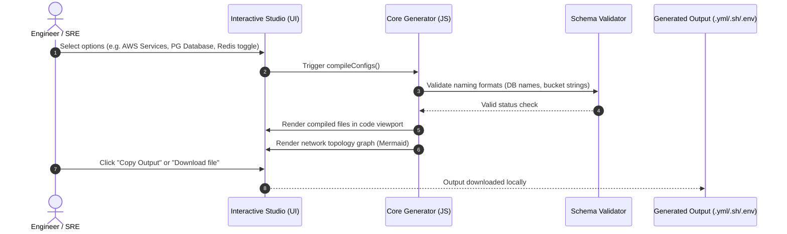
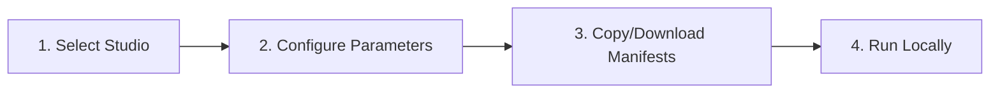

# Platform Engineering Catalog: Universal Studio Governance & Usage Guide

This document serves as the authoritative governance framework, repository registry, and usage guide for all **99 Interactive Developer Studios** in the platform engineering catalog.

---

## 1. Studio Overview

The Developer Studio platform is a centralized collection of 99 interactive engineering utilities designed to eliminate developer friction, automate boilerplate generation, and prevent configuration drift across all lifecycle stages. 

### Core Taxonomy & Categories
The catalog is structured into six strategic functional divisions:
1. **AI & Large Models (AI/LLMOps):** Tooling for RAG engines, gateway routing, observability, and distributed compute (e.g., ray-cluster, vector-db).
2. **Automation & Scaffolding:** Code template generators (e.g., docker, maven, tomcat, ansible).
3. **CI/CD Pipelines:** Standardized build, integration, and release templates (e.g., github-actions, gitlab, jenkins, tekton-pipeline).
4. **Cloud & Infrastructure:** Cloud provisioning blueprints (e.g., terraform, vpc-subnetter, crossplane-studio, kubernetes).
5. **Observability & Tracing:** Telemetry collectors and dashboard configs (e.g., otel-configurator, ebpf-tracing, logging, performance).
6. **Security & Governance:** Policy engines, secret managers, and vulnerability configurations (e.g., sast, compliance, secrets, vault-secrets).

---

## 2. Why the Studio Catalog Exists

Historically, engineers faced significant friction during bootstrap and day-2 operations due to:
* **Tribal Knowledge:** Key repository parameters and configuration structures were undocumented.
* **Configuration Drift:** Copy-pasting old configs led to security gaps, deprecated configurations, and compilation errors.
* **Live Sandbox Overhead:** Provisioning cloud sandboxes for local testing created orphan resources, exposed real API credentials, and increased cloud spend.

### Business Value
* **100% Cost Efficiency:** Encourages offline emulations (e.g., `localstack-dev`) to perform local runs before triggering expensive cloud pipelines.
* **Instant Onboarding:** Dramatically drops developer bootstrap time from hours to seconds.
* **Hardened Security:** Standardizes access policies (Kyverno, OPA, Vault, Semgrep) at the generation stage.

---

## 3. When To Use
Engineers **MUST** utilize the appropriate studio in the following 20+ real-world developer scenarios:

1. **New Project Bootstrapping:** Scaffolding standard structure templates for Java (Maven) or Go apps.
2. **Local AWS Integration Testing:** Running S3 and Postgres offline before staging push.
3. **LLM Gateway Configuration:** Setting semantic caching and fallback routes for API usage.
4. **GitHub CI Pipeline Upgrades:** Adding vulnerability scans to pull request workflows.
5. **ArgoCD App Provisioning:** Creating GitOps sync projects and application definitions.
6. **VPC Address Space Partitioning:** Slicing CIDR blocks into multi-AZ subnets without IP overlap.
7. **Container Policy Compliance:** Enforcing security contexts on Kubernetes pods via Kyverno.
8. **eBPF System Performance Audits:** Writing kernel socket hook rules to track network latency.
9. **Secrets Lifecycle Hardening:** Creating HashiCorp Vault access roles and token TTLs.
10. **Autoscaling Deployments:** Mapping queue lag sizes to Kubernetes pod scaling factors using KEDA.
11. **Drift Recovery Verification:** Setting cron checks to spot manual edits in Terraform code.
12. **Service Mesh Traffic Routing:** Building Istio canary route configurations.
13. **Database Schema Migrations:** Scaffolding rollback scripts for Postgres SQL/Liquibase.
14. **ServiceNow Incident Triggers:** Mocking change request workflows via Agile & ITSM studio.
15. **Systemd Service Scaffolding:** Creating systemctl-compliant timers for batch scripts.
16. **Nginx Reverse Proxy Optimization:** Scaffold rate limit rules and upstream servers.
17. **Model Training Monitoring:** Connecting Python experiment pipelines to MLflow registries.
18. **Vector Database Optimization:** Defining custom schemas for cosine similarity lookups.
19. **Attestation Key Rotations:** Managing confidential enclaves in AWS/Azure secure hardware.
20. **Chaos Resilience Auditing:** Generating Stress-ng manifests for pod stability reviews.
21. **Zero Trust Network Scaffolding:** Deploying secure cloudflared tunnels for remote access.

---

## 4. When NOT To Use
Do **NOT** use the Studio Catalog in these 20+ anti-patterns:

1. **Direct Production Deployment:** Applying scaffolded files directly to prod without pipeline gates.
2. **PII Data Exposure:** Storing live user passwords inside local `.env` generator boxes.
3. **Scale Testing Performance:** Relying on LocalStack S3 to bench-test production-scale throughput.
4. **Unsupported API Emulations:** Expecting complete cloud feature parity for non-core AWS systems.
5. **Static hardcoded Secrets:** Writing plain-text access tokens in Jenkinsfiles.
6. **Manual Configuration Overrides:** Manually editing generated templates inside pipelines.
7. **Bypassing Corporate Proxies:** Binding host network ports in forbidden secure environments.
8. **Cross-Region Testing:** Mocking multi-region live network transfers within local containers.
9. **Production Cache Backups:** Using local Redis cache containers for long-term database storage.
10. **Untracked Code Audits:** Deploying Kubernetes manifests without commits to git history.
11. **Bypassing CI Scanning:** Skipping Semgrep validations on generated Terraform code.
12. **Custom Framework Violations:** Disregarding the target code language style policies.
13. **Local DB Persistent Storage:** Relying on ephemeral postgres volumes to store test databases.
14. **Over-provisioning Limits:** Setting resource parameters exceeding host developer machine RAM.
15. **Direct Staging Edits:** Manually pushing code to git repositories bypassing the CodeOwners files.
16. **Live API Key Verification:** Injecting real production AWS IAM credentials to test local configs.
17. **Unsupported License Copying:** Duplicating code modules under proprietary terms without permission.
18. **Unverified Dependency Upgrades:** Upgrading package versions without testing compiler changes.
19. **Bypassing ArgoCD Sync:** Manually editing pods in live namespaces managed by GitOps.
20. **Unchecked Drift Modifications:** Modifying databases on live instances instead of generating SQL migration scripts.

---

## 5. Repository Mapping

The following catalog registers all **99 Developer Studios** to their team owners, repositories, branch policies, core dependencies, and related utilities:

| # | Studio Name | Directory Link | Target Code Repository | Team Owner | Branch | Core Dependencies | Related Studio(s) |
|---|---|---|---|---|---|---|---|
| 1 | DevOps AI RAG Studio | [ai/](file:///d:/Domain/tools/ai/index.html) | `tp-devops-ai-rag` | AI Engineering | `main` | Python, Streamlit, Langchain | Enterprise LLM, Vector DB |
| 2 | Enterprise LLM Studio | [llm/](file:///d:/Domain/tools/llm/index.html) | `tp-enterprise-llm` | AI Engineering | `main` | K8s, vLLM, Prometheus | Ray Cluster, LLM Gateway |
| 3 | Local SLM Studio | [slm/](file:///d:/Domain/tools/slm/index.html) | `tp-local-slm` | Edge Compute | `main` | Ollama, systemd, Bash | Systemd Builder, Linux Studio |
| 4 | MLflow Tracking Studio | [mlflow/](file:///d:/Domain/tools/mlflow/index.html) | `tp-mlflow-tracker` | ML Platform | `main` | Docker Compose, Python | Feature Store, DataOps Studio |
| 5 | Strands SRE Agent Studio | [strands/](file:///d:/Domain/tools/strands/index.html) | `tp-strands-sre-agent` | SRE Swarm | `main` | Strands SDK, MCP, OTel | SRE Simulator, MCP Studio |
| 6 | LLM Guardrails Studio | [llm-guardrails/](file:///d:/Domain/tools/llm-guardrails/index.html) | `tp-llm-guardrails` | AI Security | `main` | NeMo Guardrails, Python | Policy-as-Code, SAST |
| 7 | Ray Cluster Studio | [ray-cluster/](file:///d:/Domain/tools/ray-cluster/index.html) | `tp-ray-cluster` | ML Platform | `main` | Ray, Kubernetes, GPU | Enterprise LLM, KEDA Studio |
| 8 | AI Evaluation Studio | [ai-eval/](file:///d:/Domain/tools/ai-eval/index.html) | `tp-ai-evaluation` | AI Engineering | `main` | Ragas, Python, PyTest | MLflow Tracking, Performance |
| 9 | Feature Store Studio | [feature-store/](file:///d:/Domain/tools/feature-store/index.html) | `tp-feature-store` | Data Platform | `main` | Feast, Python, PostgreSQL | MLflow Tracking, DataOps Studio |
| 10 | LLM Gateway & API Router Studio | [llm-gateway/](file:///d:/Domain/tools/llm-gateway/index.html) | `tp-llm-gateway` | Platform Architecture | `main` | LiteLLM, Redis, YAML | Enterprise LLM, LLM Tracing |
| 11 | LLM Observability & Tracing Studio | [llm-tracing/](file:///d:/Domain/tools/llm-tracing/index.html) | `tp-llm-tracing` | Platform Engineering | `main` | Langfuse, OpenTelemetry | LLM Gateway, Tracing Studio |
| 12 | Vector Database Optimizer Studio | [vector-db/](file:///d:/Domain/tools/vector-db/index.html) | `tp-vector-db` | Database Ops | `main` | pgvector, Qdrant, SQL | Database Clustering |
| 13 | SRE AI Agent Simulator | [sre-simulator/](file:///d:/Domain/tools/sre-simulator/index.html) | `tp-sre-agent-simulator` | SRE Swarm | `main` | Python, Chaos Mesh, OTel | Strands SRE, Chaos Studio |
| 14 | MCP Studio | [mcp-studio/](file:///d:/Domain/tools/mcp-studio/index.html) | `tp-mcp-studio` | Platform Engineering | `main` | Node.js, JSON, MCP | Strands SRE Agent |
| 15 | Ansible Playbook Builder | [ansible/](file:///d:/Domain/tools/ansible/index.html) | `tp-ansible-automation` | Platform Engineering | `main` | Ansible, YAML, Linux | Docker Manager, Linux Studio |
| 16 | Docker Manager | [docker/](file:///d:/Domain/tools/docker/index.html) | `tp-docker-manager` | DevOps Team | `main` | Docker, Dockerfile, Alpine | Container Registry, Jenkins |
| 17 | Git Learning Studio | [git/](file:///d:/Domain/tools/git/index.html) | `tp-git-learning` | Engineering Enablement | `main` | Git, Bash, Markdown | GitHub Actions, GitLab Studio |
| 18 | Jenkins CI/CD Pipeline | [jenkins/](file:///d:/Domain/tools/jenkins/index.html) | `tp-jenkins-pipeline` | DevOps Team | `main` | Jenkinsfile, Groovy, Docker | Maven Build, SonarQube Studio |
| 19 | Terraform Architect | [terraform/](file:///d:/Domain/tools/terraform/index.html) | `tp-terraform-architect` | Cloud Infrastructure | `main` | HCL, Terraform, AWS/GCP | VPC Subnetter, Crossplane Studio |
| 20 | Advanced k8s Script Generator | [kubernetes/](file:///d:/Domain/tools/kubernetes/index.html) | `tp-kubernetes-ops` | Cloud Infrastructure | `main` | K8s, YAML, Kubectl | Helm Chart, Karpenter Studio |
| 21 | Advanced Monitoring Script Generator | [monitoring/](file:///d:/Domain/tools/monitoring/index.html) | `tp-monitoring-telemetry` | SRE Team | `main` | Prometheus, Grafana, Bash | OTEL Collector, Logging Studio |
| 22 | GitHub Actions Workflow Studio | [github-actions/](file:///d:/Domain/tools/github-actions/index.html) | `tp-github-actions-studio` | DevOps Team | `main` | YAML, GitHub Actions | GitLab Studio, Trivy Security |
| 23 | Helm Chart Scaffold Studio | [helm/](file:///d:/Domain/tools/helm/index.html) | `tp-helm-scaffold` | Cloud Infrastructure | `main` | Helm, Go Templates | Kubernetes, ArgoCD Studio |
| 24 | ArgoCD GitOps App Studio | [argocd/](file:///d:/Domain/tools/argocd/index.html) | `tp-argocd-gitops` | Cloud Infrastructure | `main` | ArgoCD, Kubernetes | FluxCD GitOps, Progressive Delivery |
| 25 | ELK & Loki Logging Studio | [logging/](file:///d:/Domain/tools/logging/index.html) | `tp-elk-loki-logging` | SRE Team | `main` | Logstash, Loki, Grafana | Monitoring, Vector Pipeline |
| 26 | Linux & PowerShell Studio | [linux/](file:///d:/Domain/tools/linux/index.html) | `tp-linux-powershell` | Platform Engineering | `main` | Bash, PowerShell | Python SRE, ShellScript SRE |
| 27 | Python SRE Utility Studio | [python/](file:///d:/Domain/tools/python/index.html) | `tp-python-sre-utility` | SRE Team | `main` | Python, Boto3, Kubernetes | Go SRE Utility, Webhooks Studio |
| 28 | ShellScript SRE Studio | [shellscript/](file:///d:/Domain/tools/shellscript/index.html) | `tp-shellscript-sre` | SRE Team | `main` | Bash, Linux coreutils | Linux Studio, Python SRE |
| 29 | GitLab CI/CD Pipeline Studio | [gitlab/](file:///d:/Domain/tools/gitlab/index.html) | `tp-gitlab-pipeline-studio` | DevOps Team | `main` | GitLab CI, YAML, Docker | GitHub Actions, Trivy Security |
| 30 | Webhooks Studio | [webhooks/](file:///d:/Domain/tools/webhooks/index.html) | `tp-webhooks-receiver` | DevOps Team | `main` | Python, FastAPI, HMAC | Status & Incident |
| 31 | Secret Management Studio | [secrets/](file:///d:/Domain/tools/secrets/index.html) | `tp-secret-management` | Security Team | `main` | Vault, Python, Sealed Secrets | Vault Secrets, GitOps Secrets |
| 32 | Chaos Engineering Studio | [chaos/](file:///d:/Domain/tools/chaos/index.html) | `tp-chaos-engineering` | SRE Team | `main` | Chaos Mesh, Kubernetes | SRE Simulator, Webhooks |
| 33 | Service Mesh Studio | [mesh/](file:///d:/Domain/tools/mesh/index.html) | `tp-service-mesh` | Cloud Infrastructure | `main` | Istio, Envoy, mTLS | API Gateway, Knative Routing |
| 34 | Distributed Tracing Studio | [tracing/](file:///d:/Domain/tools/tracing/index.html) | `tp-distributed-tracing` | SRE Team | `main` | OpenTelemetry, Python, Go | OTEL Collector, LLM Tracing |
| 35 | Policy-as-Code Studio | [compliance/](file:///d:/Domain/tools/compliance/index.html) | `tp-policy-as-code` | Security Team | `main` | OPA Rego, Kyverno | Kyverno Policy, SAST |
| 36 | Database Migration Studio | [db-migration/](file:///d:/Domain/tools/db-migration/index.html) | `tp-database-migration` | Database Ops | `main` | Liquibase, Flyway, SQL | Database Clustering |
| 37 | Performance Studio | [performance/](file:///d:/Domain/tools/performance/index.html) | `tp-performance-testing` | SRE Team | `main` | k6, Locust, Javascript | SLO Studio, Webhooks |
| 38 | SLO & Error Budget Studio | [slo/](file:///d:/Domain/tools/slo/index.html) | `tp-slo-error-budget` | SRE Team | `main` | Prometheus, Alertmanager | Alertmanager Visualizer |
| 39 | SAST Security Studio | [sast/](file:///d:/Domain/tools/sast/index.html) | `tp-sast-security` | Security Team | `main` | Semgrep, Trivy, YAML | LLM Guardrails, Policy-as-Code |
| 40 | FinOps Studio | [finops/](file:///d:/Domain/tools/finops/index.html) | `tp-finops-studio` | Platform Engineering | `main` | Cloud Custodian, Python | Karpenter Studio, GreenOps |
| 41 | DNS & SSL PKI Studio | [dns-ssl/](file:///d:/Domain/tools/dns-ssl/index.html) | `tp-dns-ssl-pki` | Platform Architecture | `main` | Certbot, Route53, Let's Encrypt | Cloudflare Zero Trust |
| 42 | Backup & DR Studio | [backup-dr/](file:///d:/Domain/tools/backup-dr/index.html) | `tp-backup-dr-studio` | SRE Team | `main` | Velero, Restic, Kubernetes | Database Clustering |
| 43 | AWS Event-Driven & Messaging SRE Studio | [event-sre/](file:///d:/Domain/tools/event-sre/index.html) | `tp-aws-event-sre` | Cloud Infrastructure | `main` | AWS SQS, EventBridge | LocalStack Dev, API Gateway |
| 44 | GitHub Org Governance & CodeOwners Studio | [github-gov/](file:///d:/Domain/tools/github-gov/index.html) | `tp-github-org-gov` | Security Team | `main` | CODEOWNERS, GitHub APIs | GitHub Actions Studio |
| 45 | Cloudflare Zero Trust & Tunneling Studio | [cloudflare-zero-trust/](file:///d:/Domain/tools/cloudflare-zero-trust/index.html) | `tp-cloudflare-zero-trust` | Security Team | `main` | cloudflared, YAML, Ingress | DNS & SSL PKI, API Gateway |
| 46 | Docker Compose & LocalStack Dev Studio | [localstack-dev/](file:///d:/Domain/tools/localstack-dev/index.html) | `tp-localstack-dev` | Platform Engineering | `main` | Docker, Postgres, Redis | Docker Manager, AWS Event-SRE |
| 47 | Status & Incident Studio | [status-incident/](file:///d:/Domain/tools/status-incident/index.html) | `tp-status-incident` | SRE Team | `main` | PagerDuty, Opsgenie, JSON | Webhooks, Agile & ITSM |
| 48 | API Gateway Studio | [api-gateway/](file:///d:/Domain/tools/api-gateway/index.html) | `tp-api-gateway` | Platform Architecture | `main` | Nginx, Traefik, YAML | Nginx Configurator, Service Mesh |
| 49 | GitOps Secrets Studio | [gitops-secrets/](file:///d:/Domain/tools/gitops-secrets/index.html) | `tp-gitops-secrets` | Security Team | `main` | SOPS, Age, GPG, YAML | Secret Management |
| 50 | IDP Template Studio | [idp-template/](file:///d:/Domain/tools/idp-template/index.html) | `tp-idp-template` | Platform Engineering | `main` | Backstage, YAML, Go | Maven Build, Docker Manager |
| 51 | Progressive Delivery Studio | [progressive-delivery/](file:///d:/Domain/tools/progressive-delivery/index.html) | `tp-progressive-delivery` | Cloud Infrastructure | `main` | Argo Rollouts, OpenFeature | ArgoCD Studio, Performance |
| 52 | Edge WASM Studio | [edge-wasm/](file:///d:/Domain/tools/edge-wasm/index.html) | `tp-edge-wasm` | Edge Compute | `main` | Spin, WebAssembly, Rust | Local SLM Studio, Linux Studio |
| 53 | Container Registry Studio | [container-registry/](file:///d:/Domain/tools/container-registry/index.html) | `tp-container-registry` | DevOps Team | `main` | Cosign, Harbor, Docker | Docker Manager, GitHub Actions |
| 54 | Database Clustering Studio | [db-clustering/](file:///d:/Domain/tools/db-clustering/index.html) | `tp-database-clustering` | Database Ops | `main` | Patroni, Redis Sentinel | Vector DB, LocalStack Dev |
| 55 | eBPF Tracing Studio | [ebpf-tracing/](file:///d:/Domain/tools/ebpf-tracing/index.html) | `tp-ebpf-tracing` | SRE Team | `main` | bpftrace, Cilium, C | eBPF Tracing Generator, Cilium |
| 56 | GreenOps Studio | [greenops/](file:///d:/Domain/tools/greenops/index.html) | `tp-greenops-studio` | Platform Engineering | `main` | Kepler, Kubernetes, Prometheus | FinOps Studio, Karpenter |
| 57 | Confidential Enclave Studio | [confidential-enclave/](file:///d:/Domain/tools/confidential-enclave/index.html) | `tp-confidential-enclave` | Security Team | `main` | Intel SGX, Nitro, JSON | Secret Management |
| 58 | Decentralized Infrastructure Studio | [decentralized-infra/](file:///d:/Domain/tools/decentralized-infra/index.html) | `tp-decentralized-infra` | Platform Architecture | `main` | IPFS, Libp2p, JSON | SRE Simulator, Logging |
| 59 | DataOps Studio | [dataops/](file:///d:/Domain/tools/dataops/index.html) | `tp-dataops-studio` | Data Platform | `main` | Apache Airflow, Python | MLflow Tracking, Feature Store |
| 60 | AIOps Studio | [aiops/](file:///d:/Domain/tools/aiops/index.html) | `tp-aiops-studio` | SRE Team | `main` | Prometheus, Python | SLO Studio, MLflow Tracking |
| 61 | Systemd Service Builder | [systemd-builder/](file:///d:/Domain/tools/systemd-builder/index.html) | `tp-systemd-service-builder` | Platform Engineering | `main` | systemd, Bash, Linux | Local SLM Studio, Linux Studio |
| 62 | VPC Subnetting Calculator | [vpc-subnetter/](file:///d:/Domain/tools/vpc-subnetter/index.html) | `tp-vpc-subnetting` | Cloud Infrastructure | `main` | HCL, Terraform, SVG | Terraform Architect |
| 63 | Nginx Configurator | [nginx-config/](file:///d:/Domain/tools/nginx-config/index.html) | `tp-nginx-configurator` | Platform Architecture | `main` | Nginx, Mermaid, HTTP | API Gateway Studio |
| 64 | Kubernetes CRD Studio | [k8s-crd/](file:///d:/Domain/tools/k8s-crd/index.html) | `tp-kubernetes-crd` | Cloud Infrastructure | `main` | K8s, OpenAPI, Go | Kubernetes, Helm Chart |
| 65 | Trivy Security Studio | [trivy/](file:///d:/Domain/tools/trivy/index.html) | `tp-trivy-security` | Security Team | `main` | Trivy, YAML, Docker | SAST Security, Container Registry |
| 66 | AI Rules Customizer | [ai-rules-customizer/](file:///d:/Domain/tools/ai-rules-customizer/index.html) | `tp-ai-rules-customizer` | Engineering Enablement | `main` | Cursorrules, Next.js | Strands SRE, Git Learning |
| 67 | Falco Security Auditor | [falco-auditor/](file:///d:/Domain/tools/falco-auditor/index.html) | `tp-falco-security-auditor` | Security Team | `main` | Falco, YAML, Syscalls | Kyverno Policy, SAST |
| 68 | Alertmanager Visualizer | [alertmanager-visualizer/](file:///d:/Domain/tools/alertmanager-visualizer/index.html) | `tp-alertmanager-visualizer` | SRE Team | `main` | Alertmanager, YAML, Mermaid | SLO Studio, Webhooks |
| 69 | Dagger Pipelines Studio | [dagger-pipelines/](file:///d:/Domain/tools/dagger-pipelines/index.html) | `tp-dagger-pipelines` | DevOps Team | `main` | Dagger, Go/Python, Docker | GitHub Actions, Gitlab Studio |
| 70 | eBPF Tracing Generator | [ebpf-generator/](file:///d:/Domain/tools/ebpf-generator/index.html) | `tp-ebpf-tracing-generator` | SRE Team | `main` | eBPF C, Python, Go | eBPF Tracing Studio, Cilium |
| 71 | Crossplane Cloud Studio | [crossplane-studio/](file:///d:/Domain/tools/crossplane-studio/index.html) | `tp-crossplane-cloud` | Cloud Infrastructure | `main` | Crossplane, Kubernetes | Terraform Architect, Kubernetes |
| 72 | Knative Serverless Studio | [knative-routing/](file:///d:/Domain/tools/knative-routing/index.html) | `tp-knative-serverless` | Edge Compute | `main` | Knative, Kubernetes, YAML | Service Mesh, Edge WASM |
| 73 | Karpenter Node Autoscaler | [karpenter-autoscaler/](file:///d:/Domain/tools/karpenter-autoscaler/index.html) | `tp-karpenter-autoscaler` | Cloud Infrastructure | `main` | Karpenter, EKS, YAML | Kubernetes, FinOps Studio |
| 74 | KEDA Autoscaling Studio | [keda-scaling/](file:///d:/Domain/tools/keda-scaling/index.html) | `tp-keda-autoscaling` | Cloud Infrastructure | `main` | KEDA, Kubernetes, YAML | Karpenter, AWS Event-SRE |
| 75 | OpenTelemetry Collector | [otel-configurator/](file:///d:/Domain/tools/otel-configurator/index.html) | `tp-opentelemetry-collector` | SRE Team | `main` | OTel, YAML, Prometheus | Distributed Tracing, Logging |
| 76 | Vector Log Pipeline Studio | [vector-pipeline/](file:///d:/Domain/tools/vector-pipeline/index.html) | `tp-vector-log-pipeline` | SRE Team | `main` | Vector, VRL, Rust | Logging Studio, eBPF Tracing |
| 77 | Kyverno Policy Studio | [kyverno-policy/](file:///d:/Domain/tools/kyverno-policy/index.html) | `tp-kyverno-policy` | Security Team | `main` | Kyverno, Kubernetes | Policy-as-Code, Falco Auditor |
| 78 | GitHub ARC Studio | [github-arc/](file:///d:/Domain/tools/github-arc/index.html) | `tp-github-arc` | DevOps Team | `main` | ARC, K8s, GitHub Runners | GitHub Actions, Karpenter |
| 79 | Terraform Drift Auditor | [terraform-drift/](file:///d:/Domain/tools/terraform-drift/index.html) | `tp-terraform-drift-auditor` | Cloud Infrastructure | `main` | Terraform, Shell, CronJob | Terraform Architect, FinOps |
| 80 | FluxCD GitOps Studio | [fluxcd-gitops/](file:///d:/Domain/tools/fluxcd-gitops/index.html) | `tp-fluxcd-gitops` | Cloud Infrastructure | `main` | FluxCD, Kubernetes, Git | ArgoCD Studio, Progressive Delivery |
| 81 | Cilium Policy Studio | [cilium-policy/](file:///d:/Domain/tools/cilium-policy/index.html) | `tp-cilium-policy` | SRE Team | `main` | Cilium, Hubble, K8s | eBPF Tracing, Kyverno Policy |
| 82 | AWS IAM Policy Analyzer | [aws-iam/](file:///d:/Domain/tools/aws-iam/index.html) | `tp-aws-iam-policy-analyzer` | Security Team | `main` | IAM, AWS JSON, Mock SDK | Secret Management, AWS Event-SRE |
| 83 | Vault Secrets Studio | [vault-secrets/](file:///d:/Domain/tools/vault-secrets/index.html) | `tp-vault-secrets-studio` | Security Team | `main` | Vault HCL, HTTP APIs | Secret Management |
| 84 | Tekton Pipeline Studio | [tekton-pipeline/](file:///d:/Domain/tools/tekton-pipeline/index.html) | `tp-tekton-pipeline` | DevOps Team | `main` | Tekton, Kubernetes, YAML | Dagger Pipelines, Jenkins |
| 85 | Go SRE Utility Studio | [go-utility/](file:///d:/Domain/tools/go-utility/index.html) | `tp-go-sre-utility` | SRE Team | `main` | Go, Go Modules, Makefile | Python SRE, ShellScript SRE |
| 86 | AWS CloudFormation Studio | [cloudformation/](file:///d:/Domain/tools/cloudformation/index.html) | `tp-aws-cloudformation` | Cloud Infrastructure | `main` | AWS CloudFormation, YAML | Terraform Architect |
| 87 | Bitbucket Pipelines Studio | [bitbucket/](file:///d:/Domain/tools/bitbucket/index.html) | `tp-bitbucket-pipelines` | DevOps Team | `main` | YAML, Bitbucket Runners | GitHub Actions, Gitlab Studio |
| 88 | Apache Tomcat Tuning Studio | [tomcat/](file:///d:/Domain/tools/tomcat/index.html) | `tp-apache-tomcat-tuning` | Platform Engineering | `main` | XML, Tomcat server, Shell | Maven Build, Systemd Builder |
| 89 | Maven Build Studio | [maven/](file:///d:/Domain/tools/maven/index.html) | `tp-maven-build` | Platform Engineering | `main` | Java POM, Maven dependencies | Tomcat Tuning, Jenkins |
| 90 | SonarQube Quality Gate Studio | [sonarqube/](file:///d:/Domain/tools/sonarqube/index.html) | `tp-sonarqube-quality-gate` | DevOps Team | `main` | SonarQube properties, YAML | Jenkins, SAST Security |
| 91 | Agile & ITSM Studio | [agile-itsm/](file:///d:/Domain/tools/agile-itsm/index.html) | `tp-agile-itsm` | Platform Operations | `main` | ServiceNow JSON, JIRA | Status & Incident |
| 92 | Pulumi Infrastructure Studio | [pulumi/](file:///d:/Domain/tools/pulumi/index.html) | `tp-pulumi` | Cloud Infrastructure | `main` | TypeScript, Python, Go, Pulumi | Terraform Architect, Crossplane |
| 93 | SLM Fine-Tuning & Quantization Studio | [qlora-tuning/](file:///d:/Domain/tools/qlora-tuning/index.html) | `tp-qlora-tuning` | AI Engineering | `main` | Python, PEFT, Hugging Face | Enterprise LLM, Local SLM |
| 94 | Prompt Registry & Versioning Studio | [promptops/](file:///d:/Domain/tools/promptops/index.html) | `tp-promptops` | AI Engineering | `main` | YAML, Python, GitOps | LLM Gateway, LLM Tracing |
| 95 | Hugging Face & GitLFS Sync Studio | [modelops-gitops/](file:///d:/Domain/tools/modelops-gitops/index.html) | `tp-modelops-gitops` | AI Engineering | `main` | Bash, GitLFS, Kubernetes | Enterprise LLM, Vector DB |
| 96 | LLM Red Teaming & Vulnerability Scanner Studio | [llm-redteaming/](file:///d:/Domain/tools/llm-redteaming/index.html) | `tp-llm-redteaming` | AI Security | `main` | Python, Garak, LLM | SAST Security, LLM Guardrails |
| 97 | AI Synthetic Data Generator Studio | [synthetic-data/](file:///d:/Domain/tools/synthetic-data/index.html) | `tp-synthetic-data` | AI Engineering | `main` | Python, pandas, pip | DevOps AI RAG, MLflow Tracking |
| 98 | GPU Scheduler & K8s Allocator Studio | [gpu-scheduler/](file:///d:/Domain/tools/gpu-scheduler/index.html) | `tp-gpu-scheduler` | AI Engineering | `main` | YAML, K8s, Kueue | Ray Cluster, Advanced k8s |
| 99 | MCP Server Builder Studio | [mcp-server/](file:///d:/Domain/tools/mcp-server/index.html) | `tp-mcp-server` | AI Engineering | `main` | Python, MCP, pip | Strands SRE Agent, MCP Studio |

---

## 6. SDLC Mapping

The catalog integrates seamlessly across all 11 phases of the Software Development Life Cycle:

* **Planning:** VPC Subnetting Calculator, Crossplane Cloud, Ray Cluster, IDP Template.
* **Development:** Docker Compose & LocalStack, systemd Service Builder, Go SRE Utility, Python SRE Utility, eBPF Tracing Generator, Maven Build.
* **Code Review:** GitHub Org Governance, SonarQube Quality Gate, AI Rules Customizer.
* **Testing:** Performance Studio (k6/Locust), AI Evaluation Studio (Ragas), Chaos Engineering.
* **Security:** SAST Security, Falco Security Auditor, Kyverno Policy, Secret Management, Vault Secrets, Trivy Security, Cloudflare Zero Trust.
* **Build:** Maven Build, Docker Manager, Container Registry Studio, Dagger Pipelines.
* **Release:** Progressive Delivery (Canaries), Webhooks Studio, ArgoCD GitOps, FluxCD GitOps.
* **Deployment:** Advanced k8s Script Generator, Terraform Architect, AWS CloudFormation, Karpenter, KEDA, Tekton Pipeline, Jenkins, GitLab CI/CD, Bitbucket Pipelines.
* **Operations:** Database Migration Studio, Backup & DR Studio, Database Clustering, Agile & ITSM.
* **Monitoring:** OpenTelemetry Collector, Advanced Monitoring Script, ELK & Loki, Vector Log Pipeline, eBPF Tracing Studio, Cilium Policy.
* **Incident Response:** Status & Incident, SRE AI Agent Simulator, Strands SRE Agent, Alertmanager Visualizer, AIOps.

---

## 7. Input Requirements

Across the 91 Developer Studios, inputs are standardized to enforce reproducibility:
1. **Target Config Selection:** Dropdown menus representing stack configurations (e.g. S3 + SQS vs All Core Services).
2. **Resource Naming:** Validation strings ensuring standard syntax rules (lowercase alphanumeric for bucket names, database names).
3. **Toggle Controls:** Boolean checkboxes mapping optional components (e.g., caching layers like Redis, queue creation scripts).
4. **Environment Context Variables:** Pre-scaffolded mock variables enabling sandbox connections out-of-the-box (e.g., `AWS_ACCESS_KEY_ID=mock_access_key`).

> [!IMPORTANT]
> The Studio generators are designed for **100% offline generation**. No external active IAM credentials, cloud authentication tokens, or network handshakes are required.

---

## 8. Output Produced

Each developer studio generates one or more of the following output types:
* **Infrastructure Manifests:** `docker-compose.yml`, `kubernetes-deployment.yaml`, `main.tf`, `Chart.yaml`.
* **Bootstrapping Scripts:** `bootstrap-aws.sh`, `install.sh`, `renew_certs.sh` written in Bash.
* **Env Files:** `.env` variables mapped to specific ports and namespaces.
* **Visual Network Diagrams:** Embedded Mermaid graphs (`graph TD`) mapping logical component interaction networks.

---

## 9. Usage Decision Tree

Use this decision flowchart to determine the correct Developer Studio category for your engineering task:

```mermaid
graph TD
    Start["What SRE / Dev task do you need to perform?"] --> Dec1{"Category of Task?"}
    
    Dec1 -->|"AWS Development / Middleware Mocking"| CategoryAWS["Local Dev & Emulations"]
    CategoryAWS --> LocalStack["Use Docker Compose & LocalStack Dev Studio"]
    CategoryAWS --> EventSRE["Use AWS Event-Driven & Messaging SRE Studio"]
    
    Dec1 -->|"AI, RAG, & Large Models (LLMOps)"| CategoryAI["AI & LLM Services"]
    CategoryAI --> Gateway["Use LLM Gateway & API Router Studio"]
    CategoryAI --> Observability["Use LLM Observability & Tracing Studio"]
    CategoryAI --> Vector["Use Vector Database Optimizer Studio"]
    
    Dec1 -->|"CI/CD Pipelines & Version Control"| CategoryPipelines["CI/CD Workflows"]
    CategoryPipelines --> Actions["Use GitHub Actions Workflow Studio"]
    CategoryPipelines --> GitLab["Use GitLab CI/CD Pipeline Studio"]
    CategoryPipelines --> Tekton["Use Tekton Pipeline Studio"]
    
    Dec1 -->|"Cloud Architecture / Infrastructure Code"| CategoryCloud["Cloud Provisioning"]
    CategoryCloud --> TF["Use Terraform Architect Studio"]
    CategoryCloud --> Subnet["Use VPC Subnetting Calculator"]
    CategoryCloud --> K8s["Use Advanced k8s Script Generator"]
    
    Dec1 -->|"Logs, Telemetry & Traces collection"| CategoryObs["Observability & SRE"]
    CategoryObs --> OTel["Use OpenTelemetry Collector Studio"]
    CategoryObs --> eBPF["Use eBPF Tracing Studio"]
    CategoryObs --> Log["Use ELK & Loki Logging Studio"]
    
    Dec1 -->|"Compliance, Scans, & IAM Policies"| CategorySecurity["Security & Auditing"]
    CategorySecurity --> SAST["Use SAST Security Studio"]
    CategorySecurity --> Kyverno["Use Kyverno Policy Studio"]
    CategorySecurity --> Secrets["Use Secret Management Studio"]
```



---

## 10. Workflow Diagram

This architecture illustrates the end-to-end user configuration, validation, compiler, and delivery pipeline:



---

## 11. Common Scenarios

### 1. Beginner Example: Offline AWS Sandbox
**Objective:** Create a local development stack emulating S3 and PostgreSQL databases.
1. Navigate to the **Docker Compose & LocalStack Dev Studio**.
2. Select **S3 + SQS (Standard Storage/Messaging)** from the dropdown.
3. Keep default DB name `emulated_db` and user `emulated_user`.
4. Leave **Add Redis Cache container** unchecked.
5. Click **Download file** for `docker-compose.yml` and `bootstrap-aws.sh`.
6. Run command:
   ```bash
   docker compose up -d
   ```

### 2. Intermediate Example: LLM Gateway with Semantic Cache Routing
**Objective:** Scaffolding a serving gateway routing requests to OpenAI and Anthropic with fallback caches.
1. Navigate to the **LLM Gateway & API Router Studio**.
2. Set routing to fallback-priority (OpenAI primary, Anthropic secondary).
3. Toggle "Enable Semantic Redis Caching" on port 6379.
4. Export the `litellm-config.yaml` file.
5. Reference the configuration inside the pipeline stack.

### 3. Advanced Example: Queue-Driven KEDA Autoscaling
**Objective:** Auto-scaling worker pods dynamically based on queue depth backlogs.
1. Navigate to the **KEDA Autoscaling Studio**.
2. Select **AWS SQS** as the active scaler trigger.
3. Configure **Target Queue Length** threshold to `50` messages.
4. Input target deployment name `event-consumer-worker`.
5. Export `scaledobject.yaml` and apply:
   ```bash
   kubectl apply -f scaledobject.yaml
   ```

### 4. Enterprise Example: eBPF System Call Auditor & Network Policies
**Objective:** Capture raw network traffic system calls using kernel probes and enforce isolation boundaries.
1. Generate the eBPF socket tracing probes using the **eBPF Tracing Generator**.
2. Scythe out network interfaces via the **Cilium Policy Studio** configuration rules.
3. Export the `cilium-policy.yaml` and `kprobe.bpf.c` templates.
4. Inject the C probes during the boot cycle to track packet flows, visualising tracing output maps via the console.

---

## 12. Integration Matrix

The following table details how the core Studio groups interact and integrate with standard DevOps/SRE systems:

| Studio Category | GitHub / GitLab | ArgoCD / FluxCD | Terraform / K8s | Prometheus / Datadog | ServiceNow / PagerDuty |
|---|---|---|---|---|---|
| **AI/LLMOps** | CI pipelines verify prompt evaluation rules. | Deploy vLLM stacks automatically via GitOps. | Provision GPU worker pools. | Track RAG latencies, token count, and errors. | Escalate LLM gateway service timeouts. |
| **Automation** | Validate Ansible/Dockerfiles on PR hooks. | Deploy configurations as base application components. | Package dependencies inside Docker files. | Track docker CPU/memory resource usage metrics. | Trigger changes on server configuration update. |
| **CI/CD** | Central config templates for runners. | Sync pipeline runner images inside cluster namespace. | Deploy runner nodes using Karpenter pods. | Export pipeline job duration & failure rates. | File changes and trigger incidents on pipeline fail. |
| **Cloud** | Trigger linting tests on infrastructure changes. | Synchronize resources automatically based on git status. | Primary compiler endpoint for tf and yaml files. | Monitor EKS node scaling and CPU limits. | Document and trigger change windows on tf apply. |
| **Observability** | Run metrics validation scripts in build stages. | Sync OpenTelemetry configurations to namespaces. | Mount config maps to logging and collector pods. | Primary configuration source for metrics and logs. | Trigger paging events on SLO alerts threshold. |
| **Security** | Block merges on Semgrep/Trivy fail reports. | Enforce compliance rules on resources before sync. | Restrict container runtime access privileges. | Track unauthorized runtime system calls. | Alert security operations on policy violations. |

---

## 13. Risks & Limitations

### 1. Parity Gaps
Mock services (such as LocalStack community edition) do not support 100% of live AWS configurations. Advanced features like RDS multi-AZ failovers, Cognito custom email flows, or Route53 hosted zone transfers must be verified in live cloud sandbox accounts before staging deployments.

### 2. Local Compute & Resource Constraints
Running multiple developer studios concurrently on local laptops can strain resources. An enterprise stack containing LocalStack, Postgres, Redis, and a local SLM (Ollama) can consume over 12GB of RAM. Developers should clean up idle stacks using:
```bash
docker system prune --volumes -f
```

### 3. Credentials Exposure Risk
The `.env` configuration files generated by studios contain mock credentials for ease of use. Developers must never copy-paste production database passwords or live AWS access keys into these mock config files to avoid potential leaks to version control repositories.

---

## 14. Quick Reference Card

Use this quick lookup card for high-frequency SRE tasks:

* **What it does:** Scaffolds configuration templates, scripts, and network manifests.
* **When to use:** Local microservice development, CI/CD pipeline automation, telemetry collector configurations, security compliance enforcement.
* **When NOT to use:** Production live environments, running high-throughput benchmark performance checks, storing live production API keys.
* **Required inputs:** Service parameters, target database configurations, middleware toggles.
* **Expected outputs:** Manifest files (`docker-compose.yml`, `main.tf`), bootstrap shells (`bootstrap-aws.sh`), env templates (`.env`).

---

## 15. Studio Classification

Each studio in the catalog is classified according to the following matrix:

* [x] **Development:** Enablers of local offline programming capabilities (e.g. LocalStack, systemd, Maven).
* [x] **DevOps:** CI/CD pipeline generators, automated build setups (e.g. GitHub Actions, Jenkins, Dagger).
* [x] **Platform Engineering:** Internal developer portal scaffolding, environment orchestrators (e.g. Crossplane, IDP).
* [x] **Security:** Rule builders, secret managers, threat auditors (e.g. SAST, Falco, Secrets).
* [x] **SRE:** Chaos engines, alert dispatch trees, diagnostic simulators (e.g. Chaos, Status & Incident, Alertmanager).
* [x] **AI/LLM:** Large model gateways, RAG configurations, vector indices (e.g. LLM Gateway, Vector DB).
* [x] **Documentation:** Developer manuals, guides, training modules (e.g. Git Learning).
* [x] **Testing:** Load runners, evaluation pipelines (e.g. Performance, AI Eval).
* [x] **Operations:** Data flow sync pipelines, DB backups (e.g. Backup & DR, Database Migration).
* [x] **Governance:** Branch protections, repository access control (e.g. GitHub Org Governance).

---

## 16. User Adoption Guide

Welcome to the Developer Studio ecosystem! This guide will get you up and running in under 5 minutes.

### 1. Why the Studios Exist
Instead of searching wikis or copy-pasting outdated configuration files, the Developer Studios provide a single interactive interface to build, validate, and download clean configurations mapped to our core repositories.

### 2. Core Repository Mapping
All templates map directly to target repository naming schemas (e.g. `tp-devops-ai-rag`, `tp-localstack-dev`). Branch policies enforce that all production changes are merged into the `main` branch.

### 3. Step-by-Step Onboarding Workflow



1. **Select the Studio:** Identify your task type (e.g., local database development) and open the appropriate studio from the **Tools Dashboard**.
2. **Configure Parameters:** Modify database names, toggle Redis caching, or customize S3 bucket names using the sidebar control cards.
3. **Copy or Download:** Use the interactive buttons to copy the manifests (e.g., `docker-compose.yml`) or scripts (`bootstrap-aws.sh`) directly.
4. **Run Locally:** Run the configurations on your developer machine using Docker/Kubernetes/Terraform CLI wrappers.

### 4. Common Onboarding Mistakes to Avoid
* **Mistake 1:** Copying live AWS credentials into the generated local `.env` variables. Keep them mock!
* **Mistake 2:** committing the generated local files into production folders instead of configuration templates.
* **Mistake 3:** Forgetting to run cleanups when switching between different database configurations.
